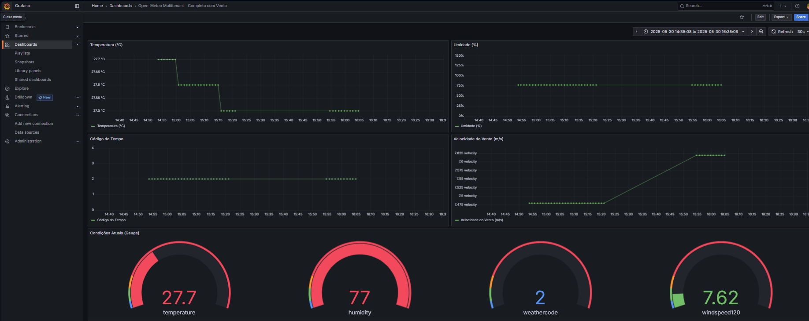

# Open-Meteo: Integração Automatizada para Cidades Inteligentes

Este projeto demonstra a integração da [Open-Meteo API](https://open-meteo.com) com a arquitetura **FIWARE**, com foco em aplicações para **cidades inteligentes** e monitoramento climático.

## Objetivo

Coletar dados meteorológicos atuais (como temperatura, umidade, velocidade do vento, etc.) e integrá-los em uma infraestrutura baseada em FIWARE, com visualização em dashboards interativos via Grafana.

## Tecnologias e Componentes

- **Open-Meteo API** – Fonte de dados climáticos atualizados.
- **Orion Context Broker** – Middleware FIWARE para gerenciamento de entidades contextuais.
- **QuantumLeap** – Persistência temporal dos dados do Orion no CrateDB.
- **CrateDB** – Banco de dados de séries temporais compatível com PostgreSQL.
- **Grafana** – Visualização dos dados via dashboards interativos.
- **Docker Compose** – Orquestração dos serviços.

## Estrutura dos Componentes

```plaintext
[Open-Meteo API]
       ↓
[Adaptador Python (open_meteo_to_orion.py)]
       ↓ (NGSI-v2)
[FIWARE Orion Context Broker]
       ↓
[QuantumLeap] → [CrateDB] → [Grafana]
```

---

## Execução

### 1. Clonar o projeto

```bash
git clone https://github.com/Alhexx/orion-smatcities.git
cd orion-smatcities
```

### 2. Subir os containers com Docker Compose

```bash
docker-compose up -d
```

### 3. Criar a subscription (manual)

#### para isso rode o seguinte comando no git bash, por exemplo:

```bash
bash scripts/create_subscription.sh
```

---

## Dashboards

O Grafana é provisionado automaticamente com:

- Gráfico de temperatura
- Umidade relativa do ar
- Código do tempo (condição climática)
- Velocidade do vento a 120 metros (pensando em armazenar dados para analise de viabilidade para aerogeradores on-shore)
- Painel tipo **gauge** com condições atuais



Acesse em: [http://localhost:3000](http://localhost:3000)

Usuario: admin

Senha: admin
